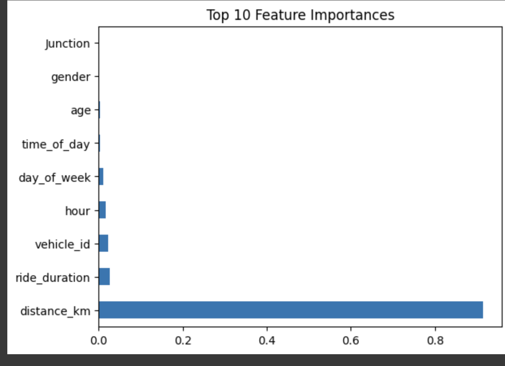
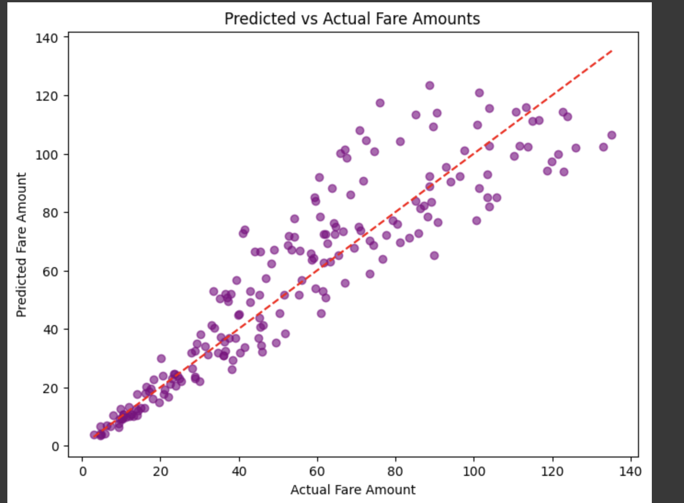
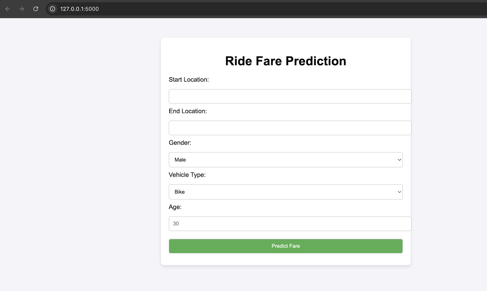
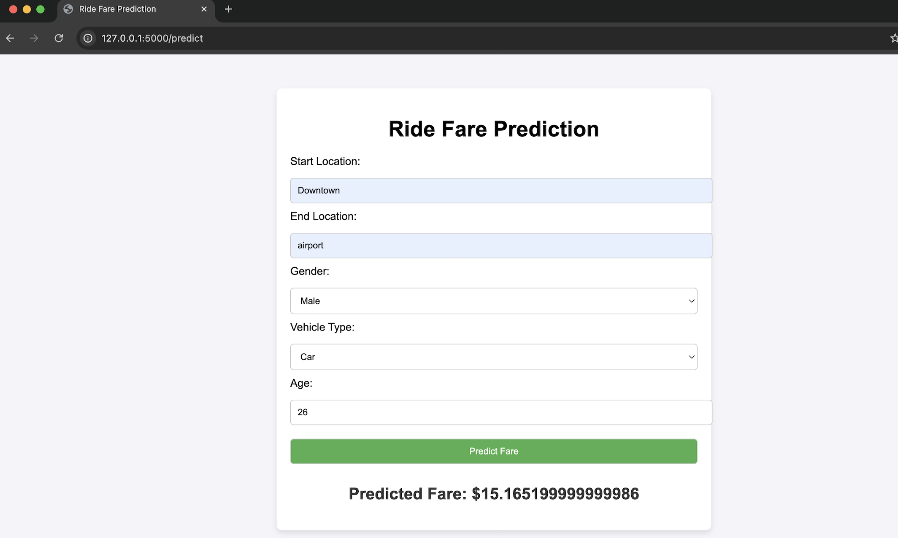
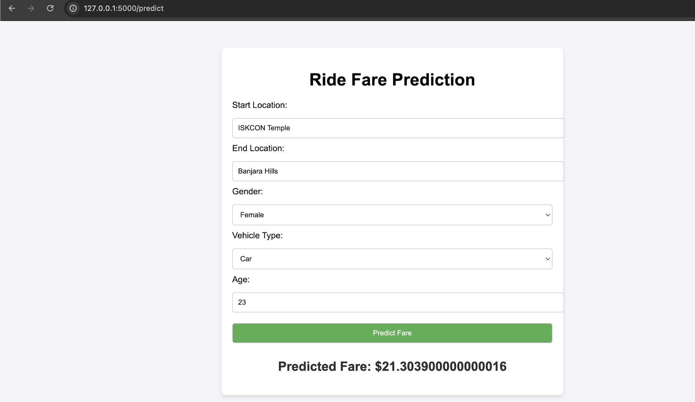

# 🚗 Ride Fare Prediction 💵

## 📖 Overview

This project aims to predict the fare amount for ride-hailing services (e.g., Ola, Uber, Lyft) based on various factors such as ride distance, driver details, user information, and traffic data. We use a **Random Forest Regressor** model to predict the fare and a **Random Forest Classifier** to categorize the fare into predefined bins (Low, Medium, High).

---

### 🛠️ The Project Involves:

- **Data cleaning and preprocessing** 🧹
- **Feature engineering** (including time-based and categorical feature creation) 🛠️
- **Model training**:
  - **RandomForestRegressor** for fare prediction 🎯
  - **RandomForestClassifier** for fare classification 📊
- **Model evaluation** using regression and classification metrics 📈

---

### 🔑 Key Features:

- Predict ride fare amount using various features 🏙️
- Classify fare amounts into categories such as "Low", "Medium", "High" 🚦
- Handle real-world data sources (traffic, user data, etc.) and preprocess them for use in the models 🌍

---

### 📦 Requirements

Before you can run this project, you need to install the following Python libraries:

- `pandas` 🐼
- `numpy` 🔢
- `matplotlib` 📊
- `seaborn` 🦜
- `scikit-learn` 🔧
- `joblib` 💾

---

### 📊 Model Evaluation

The model is evaluated using the following metrics:

- **Mean Absolute Error (MAE)**: Measures the average absolute error between predicted and actual fares.
- **Mean Squared Error (MSE)**: Measures the average squared error.
- **Root Mean Squared Error (RMSE)**: The square root of MSE, giving an idea of the magnitude of error.
- **R-squared**: Measures how well the model fits the data. A value closer to 1 indicates a better fit.

#### Sample Output:

---

### 📝 Notes

- **Data Privacy 🔒**: The datasets used in this project are anonymized, and no real user information is stored.
- **Model Improvement 📈**: You can improve the model's performance by tuning hyperparameters using **GridSearchCV** or **RandomizedSearchCV**.

---

### 🧑‍💻 Contributing

Feel free to **fork** this project, **create an issue**, or **submit a pull request**. Contributions are welcome! 🚀

---
